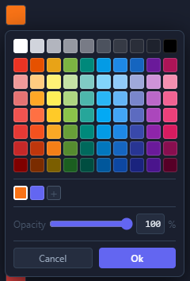
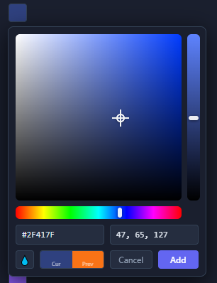

# cujuju-solidjs-color-picker

A TradingView-style color picker for [SolidJS](https://www.solidjs.com/) with canvas-based HSV controls, a curated palette grid, alpha/opacity support, saved custom colors, and EyeDropper API integration.

Zero dependencies beyond `solid-js` (peer dependency).

---

## Visual Layout

The picker has two modes: **Compact** (default) and **Full** (advanced).

### Compact Mode (palette grid)



The compact mode displays:
- **Top row**: 10 grayscale swatches (white to black)
- **Main grid**: 10x7 color palette (10 hue columns, 7 shade rows — light to dark)
- **Saved colors row**: user's custom colors with a **+** button to open the full HSV picker. Right-click any saved color to delete it.
- **Opacity slider**: 0-100% alpha control with numeric input
- **Action buttons**: Cancel / Ok

The currently selected color shows a white border on its palette swatch.

### Full Mode (advanced HSV picker, opened via "+")



The full mode provides precision color picking:
- **Saturation/Brightness canvas**: 2D square — drag horizontally for saturation, vertically for brightness
- **Shade slider**: vertical bar for quick brightness adjustment
- **Hue rainbow slider**: horizontal bar for hue selection (0-360)
- **Hex input**: type a hex color directly (e.g., `#FF6B35`)
- **RGB input**: type comma-separated RGB values (e.g., `255, 107, 53`)
- **Eyedropper button**: pick a color from anywhere on screen (Chrome/Edge only)
- **Preview swatches**: current color vs previous color side-by-side
- **Action buttons**: Cancel / Add (saves to custom colors row)

---

## Installation

```bash
npm install cujuju-solidjs-color-picker
# or
pnpm add cujuju-solidjs-color-picker
# or
yarn add cujuju-solidjs-color-picker
```

**Peer dependency:** `solid-js >= 1.7.0`

For monorepo/local development, you can reference the package directly:

```json
{
  "dependencies": {
    "cujuju-solidjs-color-picker": "file:../packages/solid-color-picker"
  }
}
```

---

## Quick Start

```tsx
import { createSignal } from 'solid-js';
import { ColorSwatch } from 'cujuju-solidjs-color-picker';

function App() {
  const [color, setColor] = createSignal('#6366f1');

  return (
    <div>
      <ColorSwatch value={color()} onChange={setColor} />
      <span>Selected: {color()}</span>
    </div>
  );
}
```

---

## API Reference

### Components

#### `ColorSwatch`

Click-to-open swatch button that renders the picker via Solid's `<Portal>` into `document.body`. This escapes ancestor `transform`/`overflow` issues (e.g., modal dialogs).

```tsx
import { ColorSwatch } from 'cujuju-solidjs-color-picker';
```

| Prop | Type | Default | Description |
|------|------|---------|-------------|
| `value` | `string` | **required** | Current color value. Accepts hex (`#rrggbb`), 8-digit hex (`#rrggbbaa`), or `rgba()` strings. |
| `onChange` | `(v: string) => void` | **required** | Called when the user picks a new color. Returns hex or 8-digit hex (when alpha < 100). |
| `size` | `number` | `26` | Swatch button size in pixels. |
| `noBorder` | `boolean` | `false` | Hide the border around the swatch button. |
| `savedColors` | `string[]` | `[]` | Array of user-saved custom color hex strings. |
| `onSavedColorsChange` | `(colors: string[]) => void` | - | Called when the saved colors list changes (add or delete). |
| `paletteRow1` | `string[]` | TV grayscale (10 colors) | Override the top grayscale row. |
| `paletteMain` | `string[]` | TV palette (70 colors) | Override the main 10x7 color grid. |
| `tokens` | `Partial<PickerTokens>` | `DEFAULT_TOKENS` | Override design tokens for theming. |

#### `CompactPicker`

The picker panel itself (without the swatch button or portal). Use this if you want to embed the picker inline or manage your own open/close and positioning logic.

```tsx
import { CompactPicker } from 'cujuju-solidjs-color-picker';
```

| Prop | Type | Default | Description |
|------|------|---------|-------------|
| `value` | `string` | **required** | Current color value. |
| `onChange` | `(hex: string) => void` | **required** | Called on every color change (live preview). |
| `onClose` | `() => void` | **required** | Called when the user clicks OK or the picker should close. |
| `savedColors` | `string[]` | `[]` | User-saved custom colors. |
| `onSavedColorsChange` | `(colors: string[]) => void` | - | Called when saved colors change. |
| `paletteRow1` | `string[]` | TV grayscale | Override grayscale row. |
| `paletteMain` | `string[]` | TV palette | Override main grid. |
| `tokens` | `Partial<PickerTokens>` | `DEFAULT_TOKENS` | Design token overrides. |

#### Canvas Sub-Components

These are the individual canvas-based controls. They can be used standalone for custom picker layouts.

##### `SaturationCanvas`

2D saturation (x-axis) / brightness (y-axis) square for a given hue.

| Prop | Type | Description |
|------|------|-------------|
| `hue` | `number` | Hue angle (0-360). |
| `saturation` | `number` | Current saturation (0-100). |
| `value` | `number` | Current brightness (0-100). |
| `width` | `number` | Canvas width in pixels. |
| `height` | `number` | Canvas height in pixels. |
| `onChange` | `(s: number, v: number) => void` | Called on click/drag with new saturation and value. |

##### `HueSlider`

Horizontal rainbow bar for picking hue (0-360).

| Prop | Type | Description |
|------|------|-------------|
| `hue` | `number` | Current hue (0-360). |
| `width` | `number` | Canvas width in pixels. |
| `height` | `number` | Canvas height in pixels (recommend 14-20). |
| `onChange` | `(hue: number) => void` | Called on click/drag with new hue. |

##### `ShadeSlider`

Vertical brightness slider (top = bright, bottom = dark).

| Prop | Type | Description |
|------|------|-------------|
| `hue` | `number` | Current hue (0-360). |
| `saturation` | `number` | Current saturation (0-100). |
| `value` | `number` | Current brightness (0-100). |
| `width` | `number` | Canvas width in pixels (recommend 14-20). |
| `height` | `number` | Canvas height in pixels. |
| `onChange` | `(v: number) => void` | Called on click/drag with new brightness value. |

---

### Utility Functions

All color conversion functions are pure, dependency-free, and exported for standalone use.

```tsx
import { hexToHsv, hsvToHex, hsvToRgb, extractAlpha, extractBaseHex, applyAlpha, parseRgbInput } from 'cujuju-solidjs-color-picker';
```

#### `hexToHsv(hex: string): HsvColor`

Convert a hex color string (`#rrggbb`) to HSV.

```ts
hexToHsv('#ff6b35');
// => { h: 18.82, s: 79.22, v: 100 }
```

#### `hsvToHex(hsv: HsvColor): string`

Convert HSV to a 6-digit hex string.

```ts
hsvToHex({ h: 210, s: 80, v: 90 });
// => "#2e73e6"
```

#### `hsvToRgb(hsv: HsvColor): { r: number; g: number; b: number }`

Convert HSV to RGB (each channel 0-255).

```ts
hsvToRgb({ h: 120, s: 100, v: 100 });
// => { r: 0, g: 255, b: 0 }
```

#### `extractAlpha(color: string): number`

Extract the alpha channel (0-100) from a color string. Supports `rgba()`, 8-digit hex, and plain hex (returns 100).

```ts
extractAlpha('#ff6b3580');  // => 50
extractAlpha('rgba(255, 107, 53, 0.5)');  // => 50
extractAlpha('#ff6b35');  // => 100
```

#### `extractBaseHex(color: string): string`

Strip alpha from any color string and return the base 7-character hex.

```ts
extractBaseHex('#ff6b3580');  // => "#ff6b35"
extractBaseHex('rgba(255, 107, 53, 0.5)');  // => "#ff6b35"
```

#### `applyAlpha(hex: string, alpha: number): string`

Apply an alpha value (0-100) to a hex color. Returns 8-digit hex when alpha < 100, standard hex otherwise.

```ts
applyAlpha('#ff6b35', 50);   // => "#ff6b3580"
applyAlpha('#ff6b35', 100);  // => "#ff6b35"
```

#### `parseRgbInput(input: string): { r, g, b } | null`

Parse a comma-or-space-separated RGB string. Returns null on invalid input.

```ts
parseRgbInput('255, 107, 53');   // => { r: 255, g: 107, b: 53 }
parseRgbInput('255 107 53');     // => { r: 255, g: 107, b: 53 }
parseRgbInput('invalid');        // => null
```

#### `supportsEyeDropper: boolean`

Runtime check for the EyeDropper API (Chromium 95+).

---

### Design Tokens

```tsx
import { DEFAULT_TOKENS, SWATCH_SIZE, mergeTokens } from 'cujuju-solidjs-color-picker';
import type { PickerTokens } from 'cujuju-solidjs-color-picker';
```

#### `DEFAULT_TOKENS: PickerTokens`

The built-in dark theme tokens:

| Token | Default | Description |
|-------|---------|-------------|
| `bg` | `#1a1f2e` | Panel background |
| `bgInput` | `#252d3f` | Input field background |
| `border` | `#334155` | Border color |
| `borderHover` | `#475569` | Border hover color |
| `radius` | `8` | Panel border radius (px) |
| `radiusSm` | `4` | Small element border radius (px) |
| `pad` | `10` | Panel padding (px) |
| `gap` | `8` | Default gap between elements (px) |
| `gapSm` | `4` | Small gap (px) |
| `text` | `#e2e8f0` | Primary text color |
| `textMuted` | `#94a3b8` | Muted text color |
| `textDim` | `#475569` | Dim text color (labels) |
| `fontSizeSm` | `12` | Small font size (px) |
| `accent` | `#6366f1` | Accent/primary button color (indigo) |

#### `SWATCH_SIZE: number`

Default swatch button size: `26` pixels.

#### `mergeTokens(overrides?: Partial<PickerTokens>): PickerTokens`

Merge partial token overrides with defaults. Returns a complete `PickerTokens` object.

---

### Palette Data

```tsx
import { TV_PALETTE_ROW1, TV_PALETTE_MAIN } from 'cujuju-solidjs-color-picker';
```

#### `TV_PALETTE_ROW1: string[]`

10 grayscale colors from white to black (displayed as the top row).

#### `TV_PALETTE_MAIN: string[]`

70 colors arranged in a 10-column x 7-row grid. Colors go from light (top) to dark (bottom) across 10 hue families: red, orange, yellow, green, teal, light blue, blue, navy, purple, pink.

---

## Usage Examples

### Basic Color Picker

```tsx
import { createSignal } from 'solid-js';
import { ColorSwatch } from 'cujuju-solidjs-color-picker';

function BasicExample() {
  const [color, setColor] = createSignal('#ef5350');
  return <ColorSwatch value={color()} onChange={setColor} />;
}
```

### With Saved Colors Persistence (localStorage)

```tsx
import { createSignal } from 'solid-js';
import { ColorSwatch } from 'cujuju-solidjs-color-picker';

function PersistentExample() {
  const [color, setColor] = createSignal('#03a9f4');

  // Load saved colors from localStorage
  const [savedColors, setSavedColors] = createSignal<string[]>(
    JSON.parse(localStorage.getItem('my-saved-colors') ?? '[]')
  );

  // Persist on change
  const handleSavedColorsChange = (colors: string[]) => {
    setSavedColors(colors);
    localStorage.setItem('my-saved-colors', JSON.stringify(colors));
  };

  return (
    <ColorSwatch
      value={color()}
      onChange={setColor}
      savedColors={savedColors()}
      onSavedColorsChange={handleSavedColorsChange}
    />
  );
}
```

### With Custom Palette

```tsx
import { ColorSwatch } from 'cujuju-solidjs-color-picker';

// Brand colors only
const brandGrays = ['#ffffff', '#f5f5f5', '#e0e0e0', '#9e9e9e', '#616161', '#212121'];
const brandColors = ['#1a73e8', '#34a853', '#fbbc04', '#ea4335', '#5f6368', '#202124'];

function BrandPicker() {
  const [color, setColor] = createSignal('#1a73e8');
  return (
    <ColorSwatch
      value={color()}
      onChange={setColor}
      paletteRow1={brandGrays}
      paletteMain={brandColors}
    />
  );
}
```

### Custom Theming (Light Mode)

```tsx
import { ColorSwatch } from 'cujuju-solidjs-color-picker';
import type { PickerTokens } from 'cujuju-solidjs-color-picker';

const lightTokens: Partial<PickerTokens> = {
  bg: '#ffffff',
  bgInput: '#f1f5f9',
  border: '#e2e8f0',
  borderHover: '#cbd5e1',
  text: '#1e293b',
  textMuted: '#64748b',
  textDim: '#94a3b8',
  accent: '#3b82f6',
};

function LightPicker() {
  const [color, setColor] = createSignal('#3b82f6');
  return <ColorSwatch value={color()} onChange={setColor} tokens={lightTokens} />;
}
```

### Alpha Channel Usage

The picker automatically detects and preserves alpha values from the input color. When the user adjusts the opacity slider, the `onChange` callback receives an 8-digit hex string.

```tsx
function AlphaExample() {
  // Start with 50% opacity
  const [color, setColor] = createSignal('#ff6b3580');

  return (
    <div>
      <ColorSwatch value={color()} onChange={setColor} />
      <div style={{ background: color(), width: '100px', height: '100px' }}>
        Semi-transparent
      </div>
    </div>
  );
}
```

### Controlled Component Pattern

```tsx
function ControlledExample() {
  const [color, setColor] = createSignal('#6366f1');

  const handleChange = (newColor: string) => {
    // Validate, transform, or restrict the color
    if (newColor !== '#000000') {
      setColor(newColor);
    }
  };

  return <ColorSwatch value={color()} onChange={handleChange} />;
}
```

### Inline Picker (without swatch button)

Use `CompactPicker` directly for embedding the picker panel inline:

```tsx
import { CompactPicker } from 'cujuju-solidjs-color-picker';

function InlinePicker() {
  const [color, setColor] = createSignal('#42a5f5');
  const [isOpen, setIsOpen] = createSignal(true);

  return (
    <Show when={isOpen()}>
      <CompactPicker
        value={color()}
        onChange={setColor}
        onClose={() => setIsOpen(false)}
      />
    </Show>
  );
}
```

### Inside a Form

```tsx
function FormExample() {
  const [formData, setFormData] = createSignal({
    name: '',
    color: '#ef5350',
  });

  const handleSubmit = (e: Event) => {
    e.preventDefault();
    console.log('Submitted:', formData());
  };

  return (
    <form onSubmit={handleSubmit}>
      <label>
        Name:
        <input
          value={formData().name}
          onInput={(e) => setFormData(d => ({ ...d, name: e.currentTarget.value }))}
        />
      </label>

      <label>
        Color:
        <ColorSwatch
          value={formData().color}
          onChange={(c) => setFormData(d => ({ ...d, color: c }))}
        />
      </label>

      <button type="submit">Save</button>
    </form>
  );
}
```

---

## How the Canvas Controls Work

All three canvas controls (SaturationCanvas, HueSlider, ShadeSlider) follow the same pattern:

1. **Render:** On mount (and when relevant props change), the component draws a gradient on an HTML `<canvas>` element using `CanvasRenderingContext2D`.

2. **Interaction:** `mousedown` starts tracking. The handler calculates the mouse position relative to the canvas bounds, converts to the appropriate color-space value, and calls `onChange`. `mousemove` (on `document`) continues tracking while dragging. `mouseup` stops.

3. **Pointer indicator:** A CSS-positioned `<div>` overlay shows the current position (crosshair circle for saturation, vertical/horizontal pill for sliders).

4. **Cleanup:** All global event listeners (`mousemove`, `mouseup`) are removed in `onCleanup` to prevent memory leaks.

### SaturationCanvas internals

Three fills layered on the canvas:
- Solid fill with the pure hue color (`hsvToHex({ h, s: 100, v: 100 })`)
- Left-to-right linear gradient: white (opaque) to white (transparent) — adds saturation
- Top-to-bottom linear gradient: black (transparent) to black (opaque) — adds brightness

### HueSlider internals

A single horizontal linear gradient with 7 color stops mapping the full 0-360 hue range: red, yellow, green, cyan, blue, magenta, red.

### ShadeSlider internals

A vertical linear gradient from the fully bright version of the current hue+saturation (top) to black (bottom).

---

## Browser Compatibility

- **All modern browsers:** Full functionality (Chrome, Firefox, Safari, Edge).
- **EyeDropper API:** Available in Chromium 95+ only (Chrome, Edge, Opera). The eyedropper button automatically hides in unsupported browsers. Detected at runtime via `supportsEyeDropper`.
- **Canvas API:** Required. All modern browsers support this.

---

## Types

All TypeScript interfaces are exported for consumer use:

```tsx
import type {
  HsvColor,           // { h: number; s: number; v: number }
  PickerTokens,       // Design token interface (14 properties)
  CtxMenuState,       // Internal context menu state
  SaturationCanvasProps,
  HueSliderProps,
  ShadeSliderProps,
  FullPickerProps,
  CompactPickerProps,
  ColorSwatchProps,
} from 'cujuju-solidjs-color-picker';
```

---

## License

MIT
